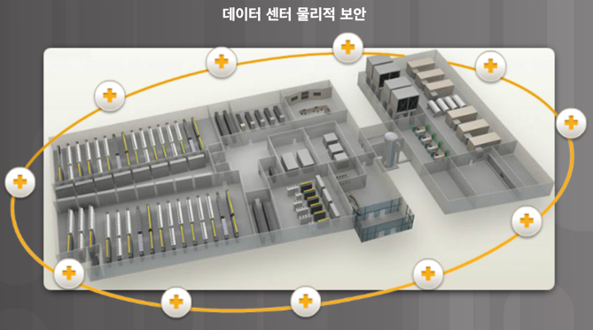

물리적 보안
오늘날의 데이터 센터는 방대한 양의 민감하고 업무상 중요한 정보를 저장한다. 따라서 물리적 보안은 운영상의 최우선 과제이다. 물리적 보안은 내부 자산에의 접근을 방지할 뿐만 아니라 사람과 장비를 보호한다. 예를 들어, 화재 경보, 스프링클러, 내진 서버 랙, 이중화 HVAC(난방, 환기, 에어컨디쇼닝), UPS 시스템은 사람과 장비를 보호하기 위해 마련되어 있다.

그림 1은 데이터 센터를 보여 준다. 자세한 내용을 보려면 원 위의 더하기 기호를 클릭한다.

데이터 센터 내의 물리적 보안은 외부와 내부의 두 영역으로 나눌 수 있다.

외부 경계 보안 - 사내 보안 책임자, 울타리, 문, 지속적인 비디오 감시, 보안 침해 경보 등이 포함될 수 있다.
내부 경계 보안 - 지속적인 비디오 감시, 전자 모션 감지기, 보안 트랩, 생체 인식 접근 및 출구 센서 등이 포함될 수 있다.
보안 트랩은 이를 통해 데이터 센터 데이터가 저장된 데이터 홀에 갈 수 있는 곳이다. 그림 2에 보인 것처럼 보안 트랩은 에어 트랩과 유사하다. 데이터 홀에 들어 가려면 우선 신분증 ID 카드를 확인하여 보안 트랩에 먼저 들어와야 한다. 보안 트랩에 들어온 후에는 얼굴이나 지문 인식 또는 다른 생체 인증을 사용하여 내부로 들어갈 수 있다. 데이터 홀을 나올 때에도 이 과정을 동일하게 반복해야 한다.

그림 3은 텍사스 앨런에 있는 Cisco Allen Data Center의 생체 인식 시스템 예이다.

https://contenthub.netacad.com/legacy/I2IoT/2.0/ko/index.html#5.1.2.2