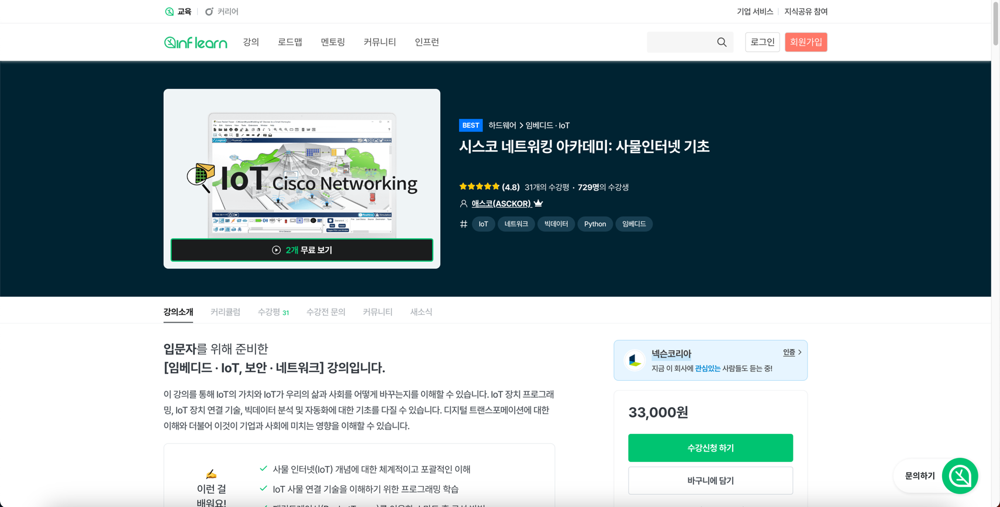
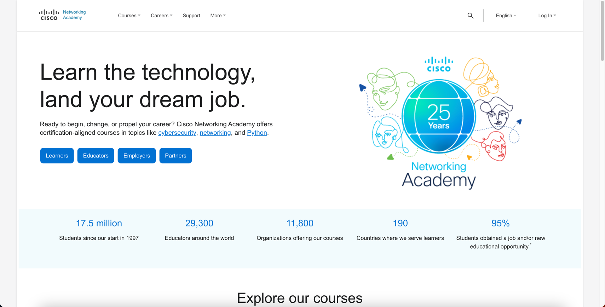
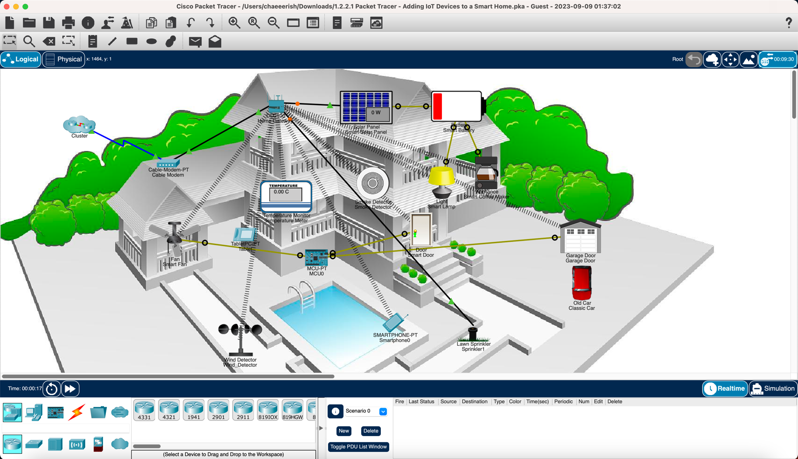

## 사물인터넷 기초 🛜

---
### 강의 👨‍🏫
[강의 사이트로 바로 가기](
https://www.inflearn.com/course/%EC%82%AC%EB%AC%BC%EC%9D%B8%ED%84%B0%EB%84%B7-%EA%B8%B0%EC%B4%88-%EC%8B%9C%EC%8A%A4%EC%BD%94)

---
### 참고 사이트 📄
[참고 사이트로 바로 가기](https://www.netacad.com/)

---
### 실습 프로그램 📉
패킷 트레이서 (단순 컴퓨터 네트워크 시뮬레이션)
